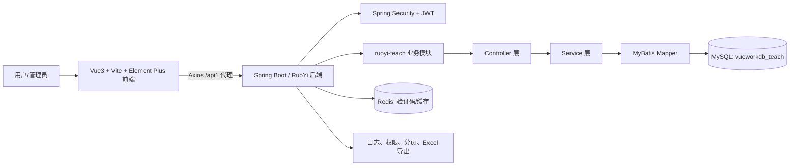
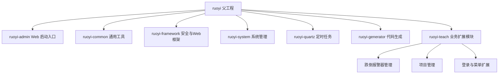
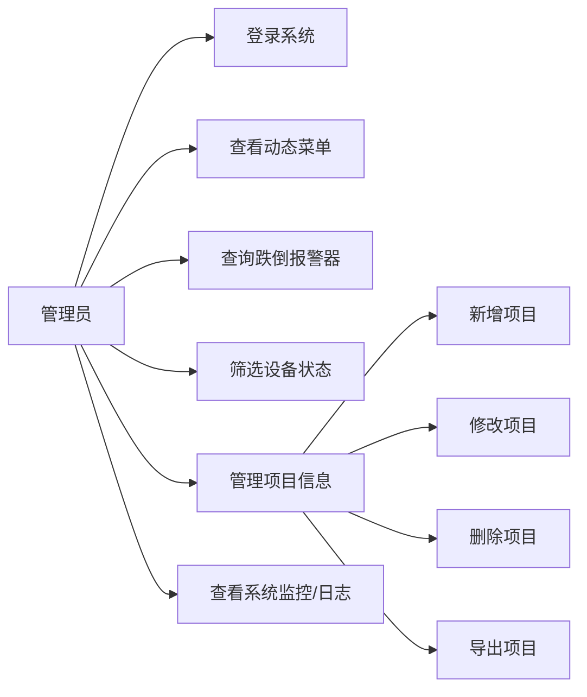
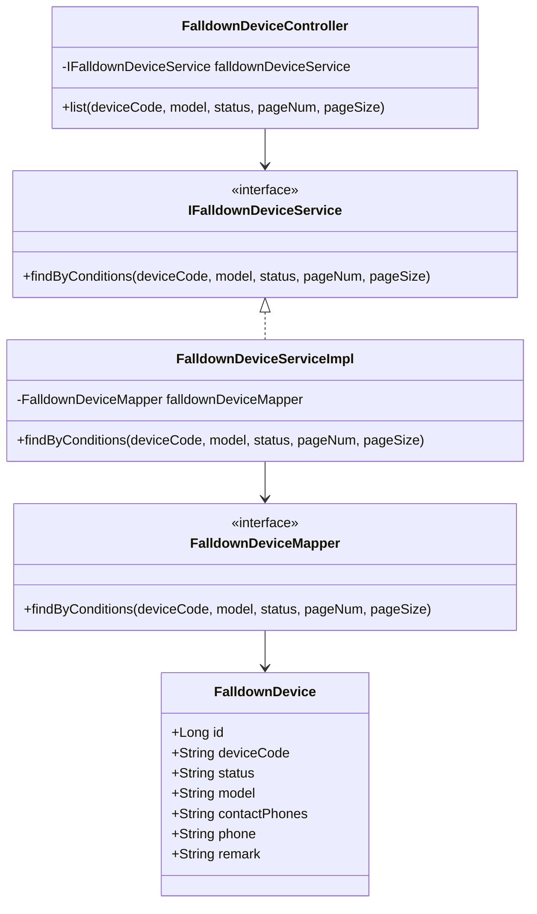
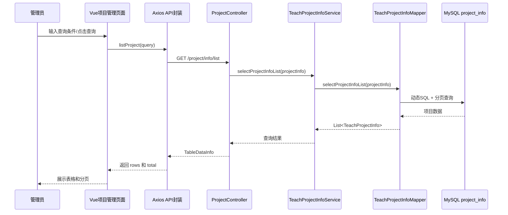

# 项目1：基于 RuoYi 的跌倒报警器与项目管理系统

## 一、摘要

本项目面向社区养老、校园安全与物联网设备管理场景，基于 RuoYi 3.8.9 快速开发框架，构建了一个前后端分离的跌倒报警器与项目管理系统。系统后端采用 Spring Boot、Spring Security、JWT、MyBatis、PageHelper、Druid 与 MySQL，前端采用 Vue3、Vite、Element Plus 与 Axios，实现了用户登录、验证码校验、动态菜单、项目资料维护、跌倒报警器只读查询、分页筛选、权限控制和基础运维监控等功能。项目创新点在于将通用后台框架与跌倒报警设备业务结合，通过独立业务模块 `ruoyi-teach` 降低耦合，并通过前端代理与模块化 API 封装提升联调效率。系统已形成可运行的后端模块、前端页面、数据库脚本和启动脚本，为后续接入真实设备、地图定位和告警推送奠定基础。

## 二、引言

### 1. 项目背景与研究意义

随着人口老龄化、校园安全管理和智慧社区建设的发展，跌倒检测与报警设备逐渐从单点硬件产品转向“设备接入、状态监控、联系人管理、告警联动、数据追踪”的综合平台。传统人工巡检方式存在响应滞后、信息分散、设备状态不透明等问题，难以及时发现异常设备或定位风险事件。

本项目以跌倒报警器管理为核心业务，结合后台管理系统常见的权限、菜单、日志、字典、数据表维护能力，构建一个可扩展的信息管理平台。项目不仅关注单一页面功能，还覆盖从数据库表、后端接口、服务层、MyBatis 映射、前端 API 封装到 Vue 页面交互的完整工程链路，能够训练软件工程课程强调的需求分析、架构设计、编码实现、调试联调和迭代优化能力。

### 2. 项目与课程目标的关联性

本项目与课程目标的关联主要体现在以下方面：

1. 创新实践：将成熟后台框架 RuoYi 与跌倒报警器业务结合，扩展出设备查询、项目管理和前端动态菜单等业务能力。
2. 工程能力培养：项目包含 Maven 多模块后端、Vue3 前端、MySQL 数据库脚本、权限菜单脚本和本地启动脚本，体现完整工程实践。
3. 软件设计能力：通过 Controller、Service、Mapper、Domain 分层组织代码，并用前端组件和 API 模块承接业务界面。
4. 测试与质量意识：项目已具备分页、条件查询、权限注解、软删除、日志注解等机制，后续可继续补充自动化测试、接口测试和 CI/CD。
5. 团队协作意识：项目结构清晰，前后端边界明确，便于多人按模块协作开发和维护。

## 三、项目背景与目标

### 1. 项目背景

#### 行业需求或技术痛点分析

跌倒报警类设备通常服务于老人、独居人员、特殊作业人员等高风险群体。设备一旦出现离线、停用、联系人缺失或状态异常，会直接影响告警链路的可靠性。因此，管理系统需要解决以下痛点：

1. 设备信息分散，无法快速按设备编号、型号、状态筛选。
2. 管理人员需要同时维护项目、人员、设备和权限信息，单独开发成本较高。
3. 设备告警系统需要具备较好的可扩展性，后续可能接入定位、地图、消息推送和统计分析。
4. 不同角色访问范围不同，需要后台权限体系支撑菜单和按钮级控制。

#### 现有解决方案的局限性

现有方案通常存在三类不足：

1. 纯表格管理系统业务耦合度高，后续接入地图、定位、告警推送时扩展成本较大。
2. 单体脚本式项目缺少统一鉴权、日志审计、分页和数据权限能力。
3. 从零搭建后台系统周期较长，容易重复开发用户、角色、菜单、字典、日志等通用功能。

本项目选择基于 RuoYi 进行二次开发，复用成熟基础能力，同时通过 `ruoyi-teach` 模块封装跌倒报警器与项目管理业务，兼顾开发效率和可维护性。

### 2. 项目目标

#### 核心功能与预期成果

项目核心功能如下：

1. 登录认证：支持验证码生成、Redis 缓存校验、用户登录与 JWT Token 下发。
2. 动态菜单：根据角色菜单关系生成前端路由菜单，并返回权限标识集合。
3. 跌倒报警器查询：支持按设备编号、设备型号、状态进行筛选，展示设备编号、型号、家属电话、设备电话、状态和备注。
4. 项目管理：支持项目列表查询、新增、修改、删除、导出等后台管理操作。
5. 权限控制：项目管理接口使用 `@PreAuthorize` 控制列表、查询、新增、修改、删除和导出权限。
6. 数据持久化：使用 MySQL 表 `falldown_device`、`project_info` 等保存业务数据。
7. 前后端联调：前端通过 Vite 代理 `/api1` 转发到后端 `http://127.0.0.1:8880`。

预期成果包括：后端 Maven 多模块工程、Vue3 前端业务页面、数据库初始化脚本、菜单权限脚本、本地启动脚本和本实验报告。

#### 创新点

1. 业务模块化：将课程业务放入独立模块 `ruoyi-teach`，与 RuoYi 原有系统模块解耦。
2. 只读设备管理：跌倒报警器页面采用只读模式，突出设备状态查询与风险查看，避免误操作修改设备基础数据。
3. 菜单树构建：通过 `MenuUtil` 将角色菜单数据转换为前端可直接使用的树形路由结构。
4. 权限与业务融合：项目管理接口复用 RuoYi 权限注解、日志注解和 Excel 工具，减少重复开发。
5. 联调配置清晰：前端 `.env.development` 与 `vite.config.ts` 统一配置代理，便于本地开发和后续部署。

## 四、方法与技术

### 1. 技术选型

#### 开发框架

后端：

1. Spring Boot 2.5.15：负责应用启动、依赖注入、Web 接口和配置管理。
2. RuoYi 3.8.9：提供用户、角色、菜单、日志、字典、监控、代码生成等基础后台能力。
3. Spring Security：负责认证、授权和权限校验。
4. JWT：用于登录后的无状态身份令牌。
5. MyBatis：负责 SQL 映射和数据库访问。
6. PageHelper：提供分页查询能力。
7. Druid：提供数据库连接池与 SQL 监控能力。
8. Redis：用于验证码缓存和登录相关缓存。
9. Swagger3：用于接口文档能力。
10. Lombok：减少实体类、服务类中的样板代码。

前端：

1. Vue3：构建前端业务页面。
2. Vite：负责前端开发服务器、构建和代理。
3. Element Plus：提供表格、表单、弹窗、分页、标签等 UI 组件。
4. Axios：封装 HTTP 请求。
5. Vue Router 与 Vuex：支持路由和状态管理。
6. TypeScript：增强前端类型约束。

数据库：

1. MySQL：保存系统基础数据和业务数据。
2. SQL 脚本：`vueworkdb_teach.sql` 提供业务表和示例数据，`sql/project_info_menu.sql` 提供项目管理菜单权限。

#### 工具链

1. Maven：后端多模块构建与依赖管理。
2. npm：前端依赖安装、开发启动和生产构建。
3. SVN：当前项目目录存在 `.svn`，说明项目可能使用 SVN 进行版本管理。
4. Git：项目包含 `.gitignore`，前端 `package.json` 中也包含 Git 仓库信息；若迁移到 Git，可采用分支与 Pull Request 协作。
5. IntelliJ IDEA：项目目录存在 `.idea`，适合进行 Java 后端开发。
6. PowerShell：`start-fall-alarm-frontend.ps1` 用于启动前端。
7. UML/Markdown 工具：本报告使用 Mermaid 描述架构图、用例图、类图和时序图，可在支持 Mermaid 的 Markdown 工具中渲染。

### 2. 系统设计

#### 总体架构图

#### 后端模块结构

#### 用例图

#### 核心类图

#### 项目管理时序图

### 3. 开发流程

#### 版本管理策略

当前项目目录存在 `.svn`，说明实际开发可能使用 SVN 进行版本管理。结合课程工程实践要求，建议采用如下策略：

1. 主干稳定：`trunk` 或 `main` 保持可运行版本。
2. 功能分支：设备管理、项目管理、登录菜单、前端页面分别在独立分支或独立提交中开发。
3. 提交规范：提交信息采用“模块 + 动作 + 说明”，例如 `feat(device): add falldown device list api`。
4. 代码评审：合并前检查接口路径、权限标识、SQL 字段映射、前端表单字段是否一致。
5. 标签发布：每次实验验收或演示版本打标签，例如 `v1.0-lab-demo`。

#### 持续集成/持续部署实践

项目当前未发现 Jenkinsfile 或 GitHub Actions 工作流文件，因此 CI/CD 仍处于可改进阶段。建议流程如下：

1. 后端 CI：执行 `mvn clean compile`、`mvn test`、`mvn package -DskipTests`。
2. 前端 CI：执行 `npm install`、`npm run lint-fix` 或 `npm run build`。
3. 数据库检查：执行 SQL 初始化脚本或 Flyway/Liquibase 迁移脚本。
4. 部署：将后端 `ruoyi-admin.jar` 部署到服务器，前端 `dist` 部署到 Nginx。
5. 环境变量：通过不同 `.env` 文件维护开发、测试、生产环境 API 地址。

本次本地校验中，Maven 未进入源码编译阶段，原因是本机 `C:\tool\apache-maven-3.9.9\conf\settings.xml` 第 170 行配置解析失败。该问题属于本机 Maven 配置问题，需修复后再执行完整构建。

## 五、实施过程

### 1. 开发阶段

#### 需求分析阶段

主要任务：

1. 明确系统角色：管理员或业务管理人员。
2. 明确核心对象：跌倒报警器设备、项目资料、用户、角色、菜单。
3. 明确功能边界：设备页面以查询为主，项目页面支持完整 CRUD。
4. 明确安全要求：登录验证码、Token 鉴权、菜单权限和接口权限。

阶段成果：

1. 形成跌倒报警器查询需求。
2. 形成项目管理增删改查需求。
3. 确定基于 RuoYi 进行二次开发。

#### 设计阶段

主要任务：

1. 设计 `falldown_device`、`project_info` 等业务表。
2. 设计后端 Controller、Service、Mapper、Entity 分层结构。
3. 设计前端 API 模块和页面组件。
4. 设计菜单权限脚本，将项目管理挂载到后台菜单。

阶段成果：

1. `ruoyi-teach` 模块承载业务代码。
2. `FalldownDeviceController` 提供设备查询接口。
3. `ProjectController` 提供项目管理接口。
4. `TeachProjectInfoMapper.xml` 和 `FalldownDeviceMapper.xml` 提供动态 SQL。
5. 前端 `src/views/device/falldowndevice/index.vue` 和 `src/views/project/info/index.vue` 实现业务页面。

#### 编码阶段

主要任务：

1. 后端实现跌倒报警器查询接口 `/device/falldowndevice/list`。
2. 后端实现项目管理接口 `/project/info/list`、`/project/info/{id}`、新增、修改、删除、导出。
3. 实现登录扩展接口 `/system/user/getCaptcha` 和 `/system/user/login`。
4. 实现角色菜单查询与菜单树构造。
5. 前端封装 `listFalldownDevice`、`listProject`、`addProject`、`updateProject`、`deleteProject` 等 API。
6. 前端实现表格、筛选、分页、弹窗编辑和删除确认。

阶段成果：

1. 后端业务模块已完成主要类与 SQL 映射。
2. 前端设备查询与项目管理页面已完成主要交互。
3. 数据库脚本提供业务表与测试数据。

#### 测试阶段

测试内容：

1. 设备查询：按设备编码、型号、状态过滤，并检查分页。
2. 项目管理：新增、修改、删除、查询和分页。
3. 登录流程：验证码生成、验证码缓存、账号密码校验、Token 返回。
4. 权限流程：项目管理接口检查权限标识。
5. 前后端联调：Vite 代理 `/api1` 到后端 `8880`。

当前发现：

1. 本地 Maven 配置文件解析失败，导致无法完成后端编译验证。
2. 多个 Java/Vue 文件存在中文编码显示异常，影响代码可读性和页面文本展示。
3. `ProjectController` 中存在重复声明的 `projectInfoService` 字段，应删除重复声明。
4. 前端部分模板文本存在引号或乱码问题，需要统一使用 UTF-8 编码重新保存。

#### 部署阶段

后端部署方式：

1. 导入数据库脚本 `vueworkdb_teach.sql`。
2. 配置 MySQL 数据库 `vueworkdb_teach`。
3. 启动后端服务，默认端口为 `8880`。
4. Redis 可使用配置中的嵌入式 Redis 或本地 Redis。

前端部署方式：

1. 进入 `VueProjectFront2/VueProjectFront`。
2. 执行 `npm install` 安装依赖。
3. 开发环境执行 `npm run dev`。
4. 也可直接运行根目录脚本 `start-fall-alarm-frontend.ps1`。
5. 生产环境执行 `npm run build`，将 `dist` 部署到 Web 服务器。

### 2. 迭代优化

#### 代码质量改进

1. 修复中文编码问题，统一项目文件编码为 UTF-8。
2. 修复 `ProjectController` 重复字段声明。
3. 对登录错误信息、页面提示信息、按钮文本进行中文校对。
4. 为设备查询接口增加参数校验，避免分页参数缺失时直接返回空列表造成前端误判。
5. 为项目管理实体补充字段注释和校验注解。
6. 将通用分页返回结构统一，减少前端对 `data.data`、`data.total` 的适配成本。

#### 功能调整

1. 跌倒报警器当前为只读模式，后续可根据权限开放新增、编辑、停用和解绑功能。
2. 接入 `falldown_location` 表，实现设备轨迹或最后位置展示。
3. 增加告警推送，例如短信、电话、WebSocket 或站内通知。
4. 增加统计看板，例如在线设备数、异常设备数、告警趋势和项目分布。
5. 增加批量导入设备和联系人功能。

## 六、成果展示

### 1. 系统功能演示

#### 登录与验证码

后端 `LoginController` 提供验证码接口和登录接口。验证码通过 Kaptcha 生成图片，验证码文本写入 Redis，并返回 `captchaId` 与 base64 图片。登录成功后，系统根据用户角色获取菜单、权限和 Token，前端可据此构造动态路由与操作权限。

#### 跌倒报警器查询

前端页面位置：`VueProjectFront2/VueProjectFront/src/views/device/falldowndevice/index.vue`

后端接口位置：`ruoyi-teach/src/main/java/com/ruoyi/teach/controller/FalldownDeviceController.java`

核心功能：

1. 按设备编码查询。
2. 按设备型号查询。
3. 按状态筛选正常或停用设备。
4. 展示设备编号、设备型号、家属电话、设备电话、状态和备注。
5. 支持分页切换和每页数量调整。
6. 页面以只读模式展示，降低误操作风险。

#### 项目管理

前端页面位置：`VueProjectFront2/VueProjectFront/src/views/project/info/index.vue`

后端接口位置：`ruoyi-teach/src/main/java/com/ruoyi/teach/controller/ProjectController.java`

核心功能：

1. 按项目名称、项目编号、负责人查询。
2. 展示项目 ID、名称、编号、负责人、状态、开始日期、结束日期、金额/进度、说明。
3. 新增项目。
4. 编辑项目。
5. 删除项目，后端使用 `DeleteTime` 软删除。
6. 导出项目列表。

#### 截图或录屏

当前代码仓库中未发现已保存的运行截图或录屏文件。建议验收演示时补充以下截图：

1. 登录页与验证码截图。
2. 跌倒报警器列表页截图。
3. 按状态筛选设备截图。
4. 项目管理列表页截图。
5. 新增或编辑项目弹窗截图。
6. 后端 Swagger 或接口调用截图。

### 2. 性能指标

本项目当前主要完成课程实验级功能实现，尚未发现正式压测报告。根据配置和代码可确认的性能相关指标如下：

1. 后端服务端口：`8880`。
2. Tomcat 最大线程数：`800`。
3. Tomcat 最小空闲线程数：`100`。
4. Tomcat accept-count：`1000`。
5. Druid 主库最大连接数：`20`。
6. Druid 最小空闲连接数：`10`。
7. Druid 慢 SQL 阈值：`1000ms`。
8. 前端设备查询分页大小支持 `10`、`20`、`50`、`100`。
9. 后端分页使用 PageHelper，避免一次性返回大量记录。

建议后续使用 JMeter 或 Postman Runner 对以下接口进行压测：

1. `GET /device/falldowndevice/list`
2. `GET /project/info/list`
3. `POST /system/user/login`

建议记录平均响应时间、P95 响应时间、错误率、吞吐量和数据库连接池占用情况。

### 3. 代码仓库

当前工作目录未检测到 Git 仓库，`git status` 返回非 Git 仓库；但项目目录存在 `.svn`，说明可能使用 SVN 管理。代码主要模块如下：

1. 后端主工程：`pom.xml`
2. Web 启动模块：`ruoyi-admin`
3. 通用基础模块：`ruoyi-common`
4. 安全框架模块：`ruoyi-framework`
5. 系统管理模块：`ruoyi-system`
6. 定时任务模块：`ruoyi-quartz`
7. 代码生成模块：`ruoyi-generator`
8. 业务扩展模块：`ruoyi-teach`
9. RuoYi Vue2 前端：`ruoyi-ui`
10. Vue3/Vite 业务前端：`VueProjectFront2/VueProjectFront`
11. 数据库脚本：`vueworkdb_teach.sql`、`sql/project_info_menu.sql`

若提交到 GitHub 或 GitLab，建议仓库说明中标注：

1. 后端启动类：`ruoyi-admin/src/main/java/com/ruoyi/RuoYiApplication.java`
2. 后端配置：`ruoyi-admin/src/main/resources/application.yml`
3. 数据源配置：`ruoyi-admin/src/main/resources/application-druid.yml`
4. 设备查询接口：`ruoyi-teach/src/main/java/com/ruoyi/teach/controller/FalldownDeviceController.java`
5. 项目管理接口：`ruoyi-teach/src/main/java/com/ruoyi/teach/controller/ProjectController.java`
6. 前端设备页面：`VueProjectFront2/VueProjectFront/src/views/device/falldowndevice/index.vue`
7. 前端项目页面：`VueProjectFront2/VueProjectFront/src/views/project/info/index.vue`

## 七、问题与解决方案

### 1. 技术难点

#### 问题一：前后端接口字段命名不一致

问题描述：数据库字段使用 `DeviceCode`、`ContactPhones`、`CreateTime` 等大驼峰或首字母大写命名，而 Java 常用小驼峰命名，前端又直接展示接口返回字段。

分析过程：若后端实体直接使用 Java 小驼峰字段，前端表格字段可能无法匹配。项目中 `FalldownDevice` 使用 `@JsonProperty` 指定返回字段名，MyBatis XML 使用 resultMap 映射数据库列与 Java 属性。

解决策略：通过 MyBatis resultMap 解决数据库到 Java 的映射，通过 `@JsonProperty` 保持前端接口字段稳定，降低前端改造成本。

#### 问题二：动态菜单与权限构造

问题描述：不同角色应看到不同菜单，前端需要树形菜单结构，而数据库中通常保存的是扁平菜单记录。

分析过程：`TeachMenuServiceImpl` 根据角色查询菜单 ID，再查询菜单项，最后通过 `MenuUtil.constructTreeMenu` 构造树形菜单。

解决策略：将菜单构造逻辑独立到工具类，统一处理父子关系、排序、图标、缓存、隐藏、外链等元信息，供登录接口一次性返回。

#### 问题三：项目删除不应直接物理删除

问题描述：项目资料属于业务管理数据，直接删除会影响审计和历史查询。

分析过程：`TeachProjectInfoMapper.xml` 中删除语句实际执行 `UPDATE project_info SET DeleteTime = NOW()`，列表查询时增加 `DeleteTime IS NULL`。

解决策略：采用软删除策略，保留历史数据，前台默认只展示未删除记录。

#### 问题四：本地构建受 Maven 配置影响

问题描述：执行 `mvn -pl ruoyi-admin -am -DskipTests compile` 时，Maven 报告本机 `settings.xml` 第 170 行 XML 解析失败。

分析过程：错误发生在 Maven 读取有效配置阶段，尚未进入项目源码编译，不能直接判断为项目代码编译失败。

解决策略：修复 Maven 全局配置文件，确保 `<mirror>` 等 XML 节点注释正确闭合，然后重新执行 Maven 编译与测试。

### 2. 协作挑战

#### 团队沟通问题

1. 前端字段名、后端实体字段名、数据库字段名不统一，容易造成联调误解。
2. 页面中文文本出现编码异常，影响前端展示和代码阅读。
3. 项目同时存在 RuoYi Vue2 前端和 Vue3/Vite 前端，团队成员需要明确当前业务开发主线。
4. 菜单权限需要数据库脚本、后端权限注解和前端路由同时匹配，单方修改可能导致页面不可见或按钮不可用。

#### 改进措施

1. 制定接口文档，明确请求参数、响应字段、字段含义和示例。
2. 统一代码文件编码为 UTF-8，并在 IDE 中固定编码设置。
3. 在 README 中注明当前推荐启动方式：后端 `ruoyi-admin`，前端 `VueProjectFront2/VueProjectFront`。
4. 菜单权限脚本与后端接口同步提交，提交说明中标注权限标识。
5. 对新增接口使用 Swagger 或 Apifox 进行共享。

### 3. 项目风险

#### 风险一：设备数据真实性不足

风险描述：当前 SQL 中存在少量测试数据，真实业务环境需要接入设备平台或硬件数据。

应对方案：定义设备接入 API，增加设备上报、状态心跳、定位上报和告警上报接口。

#### 风险二：权限配置不完整

风险描述：菜单、按钮和接口权限若不一致，可能出现页面可见但接口无权限，或接口可调用但页面不可见。

应对方案：建立权限清单，对每个页面列出菜单权限、按钮权限和接口权限。

#### 风险三：编码问题影响交付

风险描述：部分源码和页面出现中文乱码，可能导致页面文案错误甚至模板语法异常。

应对方案：统一 UTF-8 编码，逐个修复中文字符串，并增加前端构建检查。

#### 风险四：数据库连接池成为瓶颈

风险描述：Tomcat 线程数较高，但 Druid 主库最大连接数为 20，高并发查询下数据库连接可能先达到瓶颈。

应对方案：根据压测结果调整连接池、索引和分页策略，并为常用查询字段增加索引。

#### 风险五：缺少自动化测试和 CI

风险描述：目前未发现 CI 配置，依赖人工编译和手工测试，迭代时容易回归。

应对方案：增加后端单元测试、接口测试、前端构建检查，并接入 Jenkins 或 GitHub Actions。

## 八、总结与展望

### 1. 项目总结

本项目完成了基于 RuoYi 的跌倒报警器与项目管理系统雏形，实现了从数据库、后端接口、业务服务、MyBatis 映射到 Vue3 前端页面的完整链路。系统复用 RuoYi 的认证、授权、日志、分页、Excel 导出和系统监控能力，并扩展 `ruoyi-teach` 模块承载课程业务。跌倒报警器页面实现了只读查询与分页筛选，项目管理页面实现了基础 CRUD，登录接口实现了验证码、Token 和动态菜单返回。

目标达成情况：

1. 后端业务模块搭建完成。
2. 前端设备查询和项目管理页面完成。
3. 数据库表结构和菜单权限脚本具备。
4. 前后端代理和本地启动脚本具备。
5. 报告所需架构、流程、问题和展望已整理完成。

不足之处：

1. 缺少完整运行截图和压测报告。
2. 部分中文编码存在乱码，需要修复。
3. 本地 Maven 配置阻碍编译验证。
4. 自动化测试与 CI/CD 尚未完善。
5. 跌倒报警器目前以查询为主，告警推送和地图定位尚未形成完整闭环。

### 2. 未来展望

#### 功能扩展方向

1. 接入设备心跳：实时判断设备在线、离线和异常状态。
2. 接入定位地图：使用 `falldown_location` 表展示设备位置和轨迹。
3. 告警推送：支持短信、电话、邮件、站内消息或 WebSocket 实时通知。
4. 告警工单：将跌倒告警转为处理工单，记录响应人、响应时间和处理结果。
5. 数据看板：展示设备总数、在线率、告警次数、项目分布和异常趋势。
6. 移动端适配：为护理人员、社区人员提供移动端查看和处理入口。
7. 批量导入：支持 Excel 导入设备、联系人和项目资料。

#### 技术优化方向

1. 修复编码问题，统一 UTF-8。
2. 增加接口参数校验和统一异常处理。
3. 增加数据库索引，例如 `DeviceCode`、`Model`、`Status`、`PrjName`、`PrjCode`。
4. 引入 Flyway 或 Liquibase 管理数据库版本。
5. 补充 JUnit、Mockito、接口测试和前端构建测试。
6. 接入 Jenkins/GitHub Actions 实现自动构建、测试和部署。
7. 将敏感配置从源码中移出，使用环境变量或配置中心管理数据库密码和 Token 密钥。

#### 项目实际应用场景设想

1. 社区养老服务中心：管理老人佩戴的跌倒报警器，及时处理异常设备和告警。
2. 学校宿舍或实验室：对特殊人员或危险区域工作人员进行安全监测。
3. 医院康复病区：结合患者信息和护理人员信息，实现跌倒风险快速响应。
4. 工地和厂区：为高风险岗位员工配备报警设备，提高安全生产响应能力。

## 九、参考文献

[1] RuoYi-Vue 官方文档与源码，https://gitee.com/y_project/RuoYi-Vue

[2] Spring Boot Reference Documentation，https://docs.spring.io/spring-boot/

[3] Spring Security Reference，https://docs.spring.io/spring-security/reference/

[4] MyBatis 官方文档，https://mybatis.org/mybatis-3/

[5] PageHelper 分页插件文档，https://pagehelper.github.io/

[6] Vue.js 官方文档，https://vuejs.org/

[7] Vite 官方文档，https://vitejs.dev/

[8] Element Plus 官方文档，https://element-plus.org/

[9] Apache Maven 官方文档，https://maven.apache.org/

[10] MySQL 官方文档，https://dev.mysql.com/doc/
